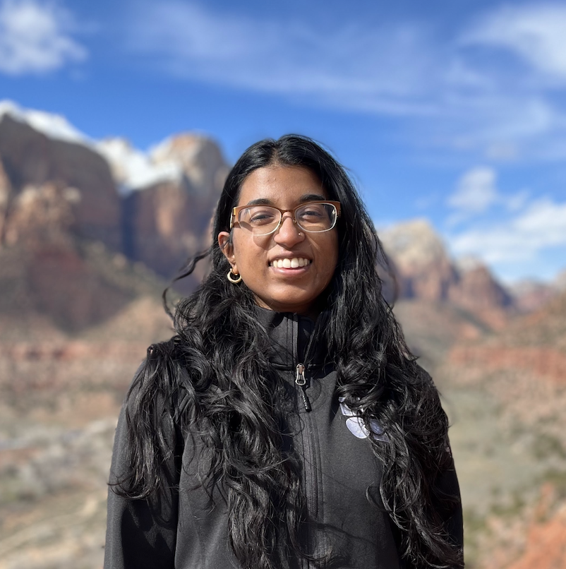

## About Me

I'm a first-year PhD student at MIT CSAIL, advised by Prof. Sara Beery! I am grateful to be supported by the MIT Jameel Clinic Fellowship and the NSF GRFP.

Previously, I was a master's student at MIT CSAIL in the [HealthyML Lab](https://healthyml.org) advised by Prof. Marzyeh Ghassemi, where I worked on detecting & mitigating distribution shift. Last summer, I was a visiting student at ETH Zurich advised by Prof. Fanny Yang, where I worked on optimal transport and differential privacy. I also attended MIT for undergrad and double majored in computer science and mathematics (Course 6 & 18) with a concentration in Ancient and Medieval Studies. I've had the pleasure to intern at Microsoft Research (x3) and Apple Research. 

I'm also on [Twitter](https://twitter.com/NHulkund) and [Google Scholar](https://scholar.google.com/citations?user=MzRVTNoAAAAJ&hl=en). Feel free to contact me at **nhulkund@mit.edu**! 

## Research Interests

I'm interested in building reliable machine learning systems, balancing tradeoffs of performance, efficiency, privacy, and robustness. Some current questions I am thinking about:
- How do we leverage knowledge from large-scale foundation models to be applied for specialized downstream tasks?
- How do we select data for large models carefully for increased robustness and resource efficiency?
- Detecting distribution shifts is well studied on datasets such as ImageNet, how well does this translate to other domains?

## Working Papers
1. **Challenges and Pitfalls of Geopolitical Data Sharing Policy for Ecological Data**\
Neha Hulkund, Millie Chapman, Ruth Oliver, Sara Beery \
*Under Review*

## Publications

1. **Privacy-preserving data release leveraging optimal transport and particle gradient descent**\
Konstantin Donhauser, Javier Abad, Neha Hulkund, Fanny Yang \
*ICLR Privacy Regulation and Protection in ML Workshop, Under Review at ICML* \
[arxiv](https://arxiv.org/abs/2401.17823)

2. **Predicting Out-of-Domain Generalization with Local Manifold Smoothness**\
Nathan Ng, Neha Hulkund, Kyunghyun Cho, Marzyeh Ghassemi \
*TMLR*\
[arxiv](https://openreview.net/pdf?id=jYkWdJzTwn)

3. **Interpretable Distribution Shift Detection using Optimal Transport**\
Neha Hulkund, Nicolo Fusi, Jennifer Wortman Vaughan, David Alvarez-Melis \
*Presented at ICML 2022 DataPerf Workshop* \
[arxiv](https://arxiv.org/pdf/2208.02896.pdf)

4. **GAN-based Data Augmentation for Chest X-ray Classification**\
Shobhita Sundaram\*, Neha Hulkund\* (equal contribution)\
*Spotlight presentation at KDD 2021 DSHealth Workshop*\
[arxiv](https://arxiv.org/pdf/2107.02970.pdf)

5. **The Limits of Algorithmic Stability for Robustness to Distribution Shift** \
Neha Hulkund, Vinith Suriyakumar, Taylor Killian, Marzyeh Ghassemi\
*Presented at NeurIPS 2022 Women in Machine Learning Workshop* \
[pdf](https://drive.google.com/file/d/1J8NJZJJv_lEI-bS6WqQHMNPTjwODvbBY/view?usp=sharing)
[poster](https://drive.google.com/file/d/1S1W2BL_NpgCNgbSkugarDmj5iFMF7EhD/view?usp=share_link)

## Class Projects
1. **Facilitating Fairness through Distributionally Robust Finetuning**\
Final Project for MIT class *6.864: Natural Language Processing*\
[pdf](https://drive.google.com/file/d/14T0o401LiZr772WwZkGg2Mf-Mt7m8Vjx/view?usp=share_link)

2. **Extension of a Bayesian Hierarchical Model for Moral Judgments**\
Final Project for MIT class *6.804: Computational Cognitive Science*\
[pdf](https://drive.google.com/file/d/1f0UMBvd9_rlW5LJxU9tn2UXnBRywyOKH/view?usp=sharing)

3. **Minimum Degree of Generating Matrices**\
Final Project for MIT class *18.821: Seminar in Mathematical Research*\
[pdf](https://drive.google.com/file/d/12xdOv5r0wrc9y5k3k1_rHAKYShrORQ4j/view?usp=sharing)

4. **Methods for Clinical Time Series Analysis in Pediatrics**\
Final Project for MIT class *6.871: Machine Learning in Healthcare*\
[pdf](https://drive.google.com/file/d/1OwCuu6WlETLEwfqDormRkT87XkeiYt6k/view?usp=sharing)

## Other
In my free time, I enjoy spending my time outdoors 
hiking/biking/sailing/kayaking in the Pacific Northwest and (most 
recently) Switzerland. 

<!-- This is a [link](http://google.com). Something *italics* and something **bold**.

Here is a table

Year | Award | Category
-----|-------|--------
2014 | Emmy  | Won Outstanding Lead Actor in a miniseries or a movie
2015 | BAFTA | Nominated for Best Leading Actor for Sherlock
2014 | Satellite | Won Best Actor miniseries or television film

Here is a horizontal rule

---

Here is a blockquote

> To a great mind, nothing is little -->

