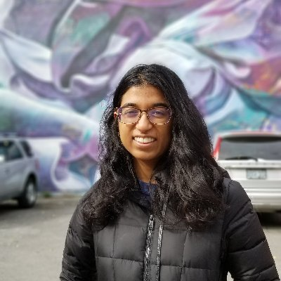

## About Me

I'm a MEng student at MIT in the [HealthyML Lab](https://healthyml.org). I work on creating trustworthy machine learning models that are robust to distribution shift.

I went to MIT for undergrad and double majored in computer science and mathematics with a concentration in Ancient and Medieval Studies. I've previously interned at Microsoft Research (x2) and Apple Research.

## Research Interest

I'm interested in building theoretically-motivated machine learning systems robust to real world distribution shifts. My other interests include interpretability, optimal transport, foundations of ML, and ML applications in healthcare domains.

## Working Papers
1. The Limits of Algorithmic Stability for Robustness to Distribution Shift \
Neha Hulkund, Vinith Suriyakumar, Taylor Killian, Marzyeh Ghassemi\
*Under review, Presented at NeurIPS 2022 Women in Machine Learning Workshop* \
[pdf](https://drive.google.com/file/d/1J8NJZJJv_lEI-bS6WqQHMNPTjwODvbBY/view?usp=sharing)
[poster](https://drive.google.com/file/d/1S1W2BL_NpgCNgbSkugarDmj5iFMF7EhD/view?usp=share_link)

2. Predicting Out-of-Domain Generalization with Local Manifold Smoothness\
Neha Hulkund, Nathan Ng, Kyunghyun Cho, Marzyeh Ghassemi \
*Under review*\
[arxiv](https://arxiv.org/pdf/2207.02093.pdf)

3. Detecting Out-Of-Distribution Examples Using Manifold Smoothness\
Neha Hulkund, Nathan Ng, Marzyeh Ghassemi\
coming soon!

## Publications

1. Interpretable Distribution Shift Detection using Optimal Transport \
Neha Hulkund, Nicolo Fusi, Jennifer Wortman Vaughan, David Alvarez-Melis \
*Presented at ICML 2022 DataPerf Workshop*
[arxiv](https://arxiv.org/pdf/2208.02896.pdf)

2. GAN-based Data Augmentation for Chest X-ray Classification\
Shobhita Sundaram*, Neha Hulkund* (equal contribution)\
*Spotlight presentation at KDD 2021 DSHealth Workshop*
[arxiv](https://arxiv.org/pdf/2107.02970.pdf)

## Other Projects
1. Facilitating Fairness in Transfer Learning through Distributionally Robust Finetuning\
*Final Project for MIT class 6.864: Natural Language Processing*
[pdf](https://drive.google.com/file/d/14T0o401LiZr772WwZkGg2Mf-Mt7m8Vjx/view?usp=share_link)
2. Extension of a Bayesian Hierarchical Model for Moral Judgments\
*Final Project for MIT class 6.804: Computational Cognitive Science*
[pdf](https://drive.google.com/file/d/1f0UMBvd9_rlW5LJxU9tn2UXnBRywyOKH/view?usp=sharing)
3. Minimum Degree of Generating Matrices\
*Final Project for MIT class 18.821: Seminar in Mathematical Research*
[pdf](https://drive.google.com/file/d/12xdOv5r0wrc9y5k3k1_rHAKYShrORQ4j/view?usp=sharing)
4. Methods for Clinical Time Series Analysis in Pediatrics\
*Final Project for MIT class 6.871: Machine Learning in Healthcare*
[pdf](https://drive.google.com/file/d/1OwCuu6WlETLEwfqDormRkT87XkeiYt6k/view?usp=sharing)

## Typography

This is a [link](http://google.com). Something *italics* and something **bold**.

Here is a table

Year | Award | Category
-----|-------|--------
2014 | Emmy  | Won Outstanding Lead Actor in a miniseries or a movie
2015 | BAFTA | Nominated for Best Leading Actor for Sherlock
2014 | Satellite | Won Best Actor miniseries or television film

Here is a horizontal rule

---

Here is a blockquote

> To a great mind, nothing is little

